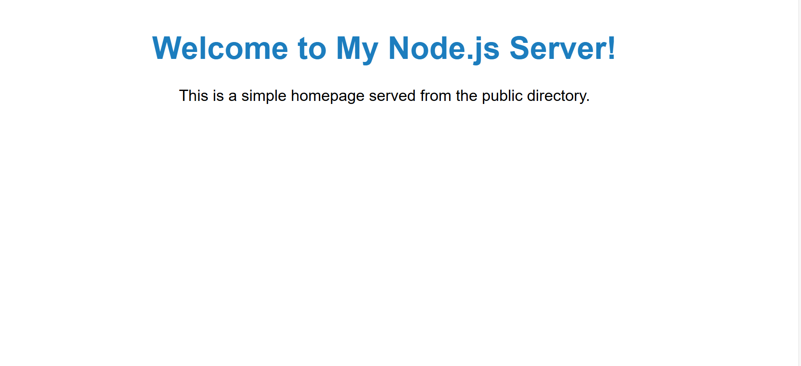

# 🌌 simple node app

This app is a basic Node.js server built with Express.js that serves a homepage and provides a RESTful API for user management. It allows you to perform CRUD operations (Create, Read, Update, Delete) on a simple dataset of users, with routes organized for easy scalability. Static files (HTML, CSS, JavaScript) are served from a public directory, while JSON data can be handled for API requests. The app includes error handling for invalid routes and supports customizable routing through Express Router.

## 🚀 Project Overview

📸 

---
## ✨ Features

- **User API**: A structured API that returns JSON data about various galaxies.
- **Static Front-End Pages**: User-friendly, responsive HTML/CSS pages to display galaxy data.

---

## 🛠️ Technologies Used

- **Node.js & Express.js**: For server and API routing.
- **HTML/CSS & JavaScript**: For front-end structure.
- **Body-Parser**: Middleware to parse JSON requests.

## 🌠 Usage Instructions
- Homepage: Visit http://localhost:3000 to see the homepage.
- users data: Navigate to http://localhost:3000/users to view the galaxy information fetched from the API.
single user data- : Access raw JSON data at http://localhost:3000/users/1

## 📫 Author 👨‍💻
- [Linkedin](https://www.linkedin.com/in/breshna-hamidi-67699a295?utm_source=share&utm_campaign=share_via&utm_content=profile&utm_medium=android_app)
- [Email](breshna2004@gmail.com)